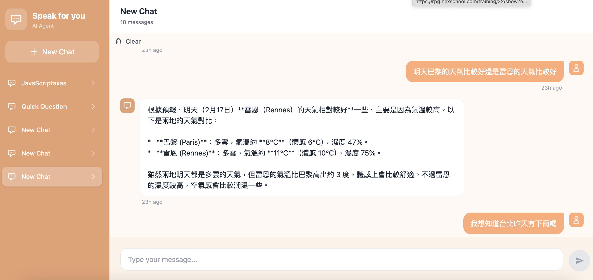

# AI Agent - 智慧對話助理


一個整合 Google Gemini (Function Calling) 與 OpenWeather API 的全端聊天應用。AI 會自動判斷語境並呼叫天氣工具，提供即時資訊。

🔗 [Live Demo](https://ai-agent-pi-nine.vercel.app/) | 📑 [開發歷程](./PROGRESS.md)

---

## 🚀 技術亮點

- **Frontend**: React 19 + TypeScript + Zustand + Tailwind CSS 4 (Deployed on Vercel)
- **Backend**: Node.js + Express (Deployed on Fly.io via Docker)
- **AI Core**: Gemini-2.0-Flash 支援 Agent Loop，可處理多輪工具呼叫
- **Tooling**: 模組化工具設計，整合 OpenWeatherMap 即時/預報 API
- **DevOps**: GitHub Actions 自動化 CI/CD

---

## 🏗️ 核心架構

### 工作流程
```
使用者 → 前端 UI → 後端 API → Gemini API
                         ↓
                   Tool Executor → Weather API
                         ↓
                   格式化回應 → 前端顯示
```

### Agent Loop 流程



```
1. 使用者："台北明天天氣？"
2. Gemini 判斷需要呼叫 getWeatherForecast
3. 後端執行工具，取得天氣資料
4. Gemini 整理資料生成自然語言回覆
5. 回傳："台北明天晴天，25°C..."
```

### 資料夾結構
```
ai-agent-backend/
├── routes/       # API 路由與 HTTP 邏輯
├── tools/        # 工具定義 (Schema) 與執行邏輯 (Executor)
└── utils/        # 外部 API 封裝 (Weather API)

ai-agent/
├── src/
│   ├── store/    # Zustand 狀態管理
│   ├── components/  # React 組件
│   └── types/    # TypeScript 型別定義
```

---

## 🛠️ 快速啟動

**後端**：
```bash
git clone https://github.com/linlindon/speak-for-you-agent-backend.git
cd speak-for-you-agent-backend
```

**前端**：
```bash
git clone https://github.com/linlindon/speak-for-you-agent.git
cd speak-for-you-agent
```

### 2. 設定環境變數

**後端** (`ai-agent-backend/.env`)：
```bash
GEMINI_API_KEY=你的_Gemini_API_Key
OPENWEATHER_API_KEY=你的_OpenWeather_API_Key
PORT=3001
```

**前端** (`ai-agent/.env.local`)：
```bash
VITE_API_URL=http://localhost:3001
```

### 3. 啟動服務

**後端**：
```bash
npm install
npm run dev
```

**前端**：
```bash
npm install
npm run dev
```

開啟瀏覽器訪問 `http://localhost:5173`

---

## 💡 核心收穫

- **Agent 實作**: 理解 AI 如何透過 Function Calling 達成「思考 → 行動 → 觀察」的迴圈
- **架構解耦**: 實作前後端分離，並透過 Docker 達成一致的開發與部署環境
- **狀態管理**: 運用 Zustand 簡化複雜的對話流與 UI 狀態切換
- **工具模組化**: 透過關注點分離，讓新增工具不影響既有程式碼

---

## 📚 專案文件

- [PROGRESS.md](./PROGRESS.md) - 完整開發歷程與設計決策
- [DEV_GUIDE.md](./DEV_GUIDE.md) - 快速上手指南

---

## 🙏 致謝

- 靈感來源：[Fly.io - You Should Write An Agent](https://fly.io/blog/everyone-write-an-agent/)
- 開發輔助：Claude AI